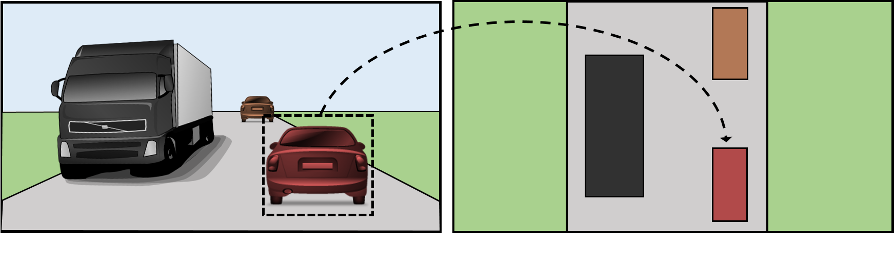
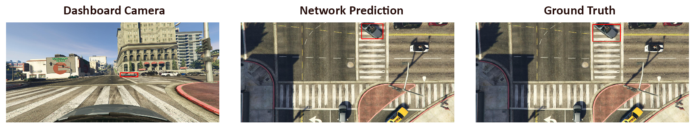

# Learning to Map Vehicles into Bird's Eye View

  

This code accompanies the paper *"Learning to map surrounding vehicles into bird's eye view using synthetic data"*.

It contains the code for loading data and pre-trained SDPN model proposed in the paper.

## How-to-run

Script entry-point is in **[main.py](main.py)**. 

When **[main.py](main.py)** is run, *pretrained weights* are automatically downloaded and injected in the **[model](model.py)**.

Model is then used to perform and inference on a sample data, mapping a car from the dashboard camera view to the bird's eye view of the scene. If everything works correctly, the output should look like this.

  

#### Dependencies
The code was developed with the following configuration:
* python 2.7.11
* numpy 1.11.2
* opencv 3.1.0
* Theano 0.9.0.dev3
* Keras 1.1.2

Other configuration will reasonably work, but have never been explicitly tested.

## Dataset 
In this repository only one example is provided, to the end of verifying that the model is working correctly.

The **whole dataset**, which comprises more than **1M** couples of bounding boxes, can be found <a href="http://imagelab.ing.unimore.it/imagelab/page.asp?IdPage=19" target="_blank"><b>here</b></a>.

